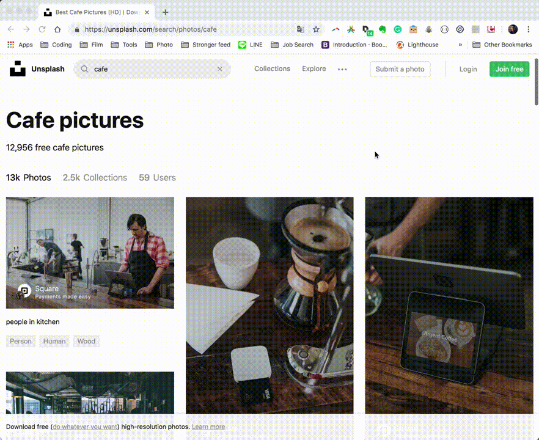

## Project First Look


## Features
| Functions                                                      |
| ---------------------------------------------------------------|
| Generate customized placeholder image                          |
| Generate URL reports with all available size of the image      |
| Generate customized placeholder video Webm (this takes a while)|

## Installation
The following instructions will get you a copy of the project and all the setting needed to run it on your chrome.


### Prerequisites

- [Google Chrome](https://www.google.com/chrome/)


### Setup

1. Open the Extension Management page in Chrome

```
chrome://extensions
```

2. Enable Developer Mode & Click on **LOAD UNPACKED**

```
Select the extension directory: find-placeholder-image
```

 

3. Find the Extension Box for successful installation


## How To Use
### Generate customized placeholder image
1. Click on extension icon.
2. In **Generate Placeholder Image** section, input your need of your placeholder image.
3. Click on **Generate** button.
4. Click on **OPEN** button to open the image in a new tab / **COPY** button to copy the URL.





### Generate Placeholder Video
1. Click on extension icon.
2. In **Generate Placeholder Video** section, input time.
3. Click on **Generate**. This gonna take the X seconds to generate that video.
4. Click on **Download** button to save your video.


## Authors

Based on this [extension](https://github.com/smallpaes/find-placeholder-image.git) 
